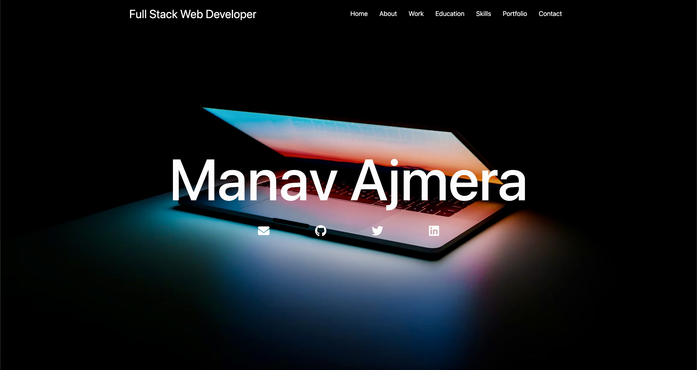

# Full Stack Web Developer Portfolio Project

Welcome to my Full Stack Web Developer portfolio project! This repository showcases my skills, experience, and projects as a full stack web developer using React and Node.js.

## Table of Contents

- [Introduction](#introduction)
- [Technologies Used](#technologies-used)
- [Projects](#projects)
- [Installation](#installation)
- [Usage](#usage)
- [Contact](#contact)

## Introduction

I am a passionate full stack web developer with a focus on creating efficient and dynamic web applications. This portfolio project demonstrates my proficiency in both frontend and backend development, as well as my ability to deliver user-friendly and responsive solutions.

## Technologies Used

- **Frontend:** React, HTML, CSS, JavaScript
- **Backend:** Node.js, Express.js
- **Database:** MongoDB, MySQL
- **Version Control:** Git, GitHub
- **Deployment:** Heroku, Netlify

## Projects

### Project 1: Corporate Company Website

**Description:** A fully functional corporate website for an Automobile company showcases its products, services and about information.

### Project 2: Tourism Website

**Description:** A tourism website showcases different trips offered by the company, contact information, booking of trips, etc.

<!-- ### Project 3: Blogging Platform

**Description:** A blogging website where users can write, edit, and publish articles. Includes user profiles and the ability to comment on articles.

**GitHub Repository:** [Blogging Platform Repo](https://github.com/yourusername/blogging-platform) -->

## Installation

1. Clone the repository: `git clone https://github.com/Manavv20/bio-data.git`
2. Navigate to the project directory: `cd bio-data`
3. Install frontend dependencies: `cd client && npm install`
4. Install backend dependencies: `cd ../server && npm install`
5. Create a `.env` file in the `server` directory and add necessary environment variables.

## Usage

1. Start the backend server: `cd server && npm start`
2. Start the frontend development server: `cd client && npm start`
3. Access the application in your browser at `http://localhost:3000`

## Contact

Feel free to reach out to me if you have any questions, suggestions, or job opportunities!

- GitHub: [Manavv20](https://github.com/Manavv20)
- LinkedIn: [Manav Ajmera](https://www.linkedin.com/in/manav-ajmera20)
- Email: manavajmera03@gmail.com

Thank you for checking out my Full Stack Web Developer portfolio project. I'm excited to continue learning and creating!

## Screenshots

1. Home Page

2. About Page

3. Work Page
